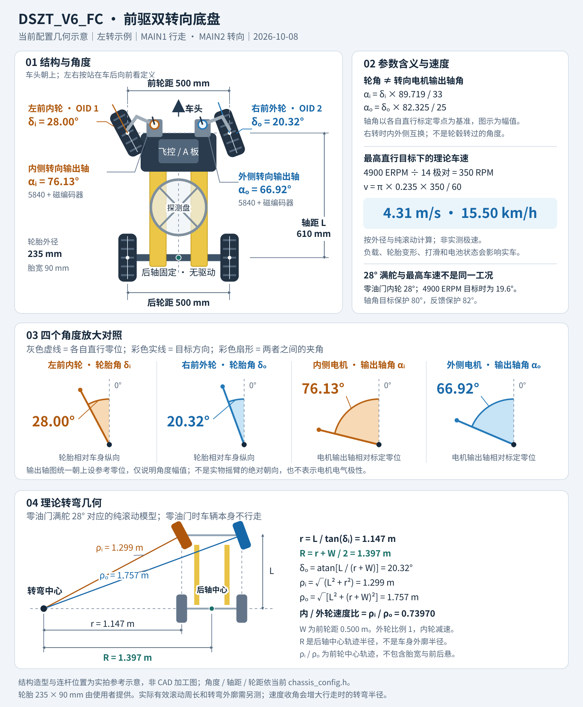

# DSZT_V6_FC

基于 DSZT_V6 的飞控专用 A 板固件：四轮底盘，前轮双 OID 行走、双 5840 转向及 MT6826S 位置闭环。MAIN1 是唯一行走输入，MAIN2 是唯一转向输入；不使用 MC7、SBUS、CH5 或 CH7。

本版本位于 `dszt-project-team/DSZT_V6` 仓库的 **`codex/dszt-v6-fc`** 独立分支；`main` 保留 MC7 版 V6，不互相替换。FC 分支保留本版本的控制与接线说明，原 V6 厂商手册及硬件附件仍在 `main` 的 `Doc/` 中。

## 车辆结构与理论参数

[打开高清矢量图](Doc/assets/dszt-v6-fc-geometry.svg)。图中为**左转**，双转向连杆一端是车头；左右按站在车后朝车头看定义，右转时内外轮互换。轮角是轮胎相对直行方向的角度，输出轴角是对应 5840 转向电机相对标定零点的角度，两者不能混用。

| 参数 | 当前值与含义 |
|---|---|
| 轴距 / 前轮距 / 后轮距 | 610 / 500 / 500 mm，均按轴线或轮中心计 |
| 轮胎外径 / 宽度 | 235 / 90 mm；使用者提供的尺寸，不是带载有效滚动直径测量值 |
| 零油门满幅内 / 外轮角 | 28.00° / 20.32° |
| 对应内 / 外转向输出轴角 | 76.13° / 66.92°；现有连杆比例换算目标幅值 |
| 轴角目标 / 反馈保护 | 80° / 82°，不等于机械硬限位 |
| 后轴中心理论转弯半径 R | 1.397 m；内侧投影半径 r 为 1.147 m，两者相差半个前轮距 |
| 内 / 外前轮中心轨迹半径 | 1.299 / 1.757 m；对应内 / 外轮速度比 0.73970 |
| 最高直行目标下的理论车速 | 4900 ERPM、14 极对 → 350 RPM → **4.31 m/s（15.50 km/h）** |

车速按 `v = (ERPM / 极对数) × π × 轮胎外径(m) / 60` 计算，假设轮毂直驱、两侧轮径相同且纯滚动；不是实测极速。**28° 满舵与最高直行速度不是同一工况**：速度收角使 4900 ERPM 行走目标下的满幅内轮角降为 19.6°。图中的最小半径是零油门满舵对应几何值，不代表零油门时车辆行走，也不含胎宽、车身和探测盘扫掠外廓。计算与控制链见 [Wiki](Doc/DSZT_V6_FC_Wiki.md)。

## FC 固件下载

[FC 固件 v6-fc-20261008](https://github.com/dszt-project-team/DSZT_V6/releases/tag/v6-fc-20261008) 提供 `DSZT_V6_FC.hex`、带调试符号的 `DSZT_V6_FC.axf`、`SHA256SUMS.txt` 和 `BUILD_INFO.txt`。按固定 FC 标签下载，不使用仓库的通用 `latest` 链接，避免取得 MC7 版固件。

该固件面向 STM32F427IIHx A 板，默认双转向闭环，MAIN1/MAIN2 控制，UART7 默认 `DBG FC`；内置本车编码器零点（左 3189、右 3073）和机械参数。不同车辆须先核对接线、零点、OID 地址与参数，不能直接套用。HEX 含地址信息，AXF 用于 MDK 下载与调试；具体构建提交和校验值见发布附件。下载前隔离电机动力或固定架空，飞控双路回中，保留独立物理动力切断手段。

## 使用边界

- 上电进入飞控控制流程，但不是上电立即执行非零指令：两路 PWM 健康、完成预热及连续双回中后才释放。
- 任一路输入异常时请求双 OID 零速、转向停机刹车；恢复后重新双回中。零速请求不等于机械瞬时停止。
- 仅靠 MAIN1/MAIN2 无法识别飞控是否解锁，也无法识别持续重复的合法非零错误目标。飞控未解锁或失控时必须输出中位或停止脉冲；独立物理动力切断不能省略。
- 当前默认正常双转向闭环。单轮开环为编译期维护模式，使用 MAIN2 点动，禁止行走。

## 工程与说明

| 项目 | 内容 |
|---|---|
| MCU / 工具链 | STM32F427IIHx / Keil MDK ARMCC 5 |
| 工程 / 目标 | [MDK-ARM/DSZT_V6_FC.uvprojx](MDK-ARM/DSZT_V6_FC.uvprojx) / `DSZT_V6_FC` |
| 外设配置 | [DSZT_V6_FC.ioc](DSZT_V6_FC.ioc)，HSE 12 MHz、SYSCLK 168 MHz、HAL TIM6、RTOS SysTick |
| 控制与诊断手册 | [项目 Wiki](Doc/DSZT_V6_FC_Wiki.md) |
| 接线 | [A 板接线表](Doc/DSZT_V6_FC_接线表.md) |
| 功能边界与移植方案 | [飞控专用方案](Doc/DSZT_V6_FC_功能边界.md) |
| 参数入口 | [底盘配置](application/chassis/chassis_config.h)、[命令配置](application/command/command_config.h)、[诊断配置](application/debug/debug_config.h) |
| 主机回归 | [测试说明](tests/README.md)；不连接硬件 |
| 第三方说明 | [THIRD_PARTY_NOTICES.md](THIRD_PARTY_NOTICES.md) |

直接用 MDK 打开工程并 Rebuild。产物为 `MDK-ARM/DSZT_V6_FC/DSZT_V6_FC.axf` 和 `.hex`。重新生成 CubeMX 后，应核对自定义工程分组、相对路径及 `main.c` 的 `RobotInit()`、`freertos.c` 的 `RobotTask()` 用户区钩子；不得把另一个 DSZT 工程的源文件路径编入本工程。

`./tools/check_project.ps1` 可只读检查工程文件/包含路径、SBUS 外设移除及本地文档链接；应用回归运行 `./tests/run_host_tests.ps1`。

本项目继承 V6 的机械、编码器零点和 OID 参数，独立维护飞控专用控制链。2026-10-08，使用者确认 DSZT_V6_FC 已完成多次落地测试，当前功能效果满足使用要求。故障注入和极端工况不因日常功能通过而视为全部验证，安全边界见 Wiki；原 DSZT_V6 保持独立。
